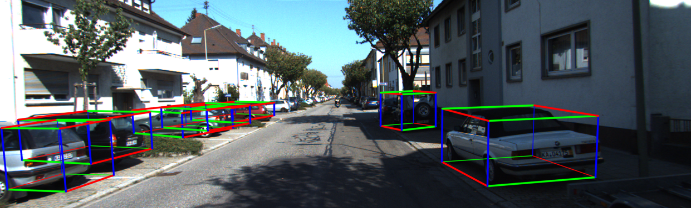

# Object SLAM #
Open source code for Online Object-Level SLAM with Dual Bundle Adjustment.


## Installation

### Prerequisites
We test the source code in **ROS Melodic, Ubuntu 18.04, Opencv 3**. Create or use existing a ros workspace.
```bash
mkdir -p ~/object_slam/src
cd ~/object_slam/src
catkin_init_workspace
git clone https://github.com/Jake755/object_slam.git
cd object_slam
```

### Compile dependencies
```bash
sh install_dependenices.sh
```

### Compile
```bash
cd ~/object_slam
catkin_make -j4
```


## Running #
```bash
source devel/setup.bash
roslaunch object_slam mono_KITTI.launch
```

